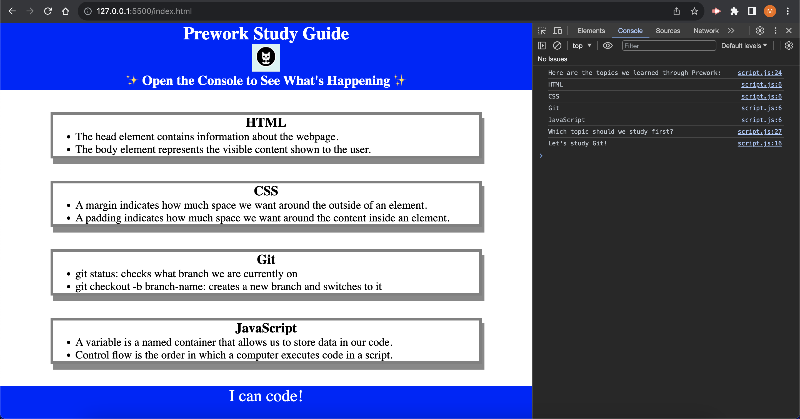

# Prework Study Guide - Coding Bootcamp

## Description

The driving force behind this Prework Study Guide web application was a desire to assist fellow students in the Coding Bootcamp at Columbia Engineering University. The goal was to create a practical tool that simplifies note-taking and summarization of class topics, fostering a more efficient learning experience. Additionally, the project served as an opportunity to delve into coding languages such as HTML, CSS, JavaScript, and Markdown, while also introducing the use of GitHub.

## Installation

N/A

## Usage

To use this application correctly you can check the notes in each section. Also, using the Chrome DevTools by pressing Control+Shift+I (Windows) or Command+Option+I (macOS), a console panel will open either on the side or below the webpage in the browser, showing you a list of the topics of the Prework Study Guide along with a suggestion on which topic to study first.

## Credits

N/A

## License

Please refer to the LICENSE in the repo.